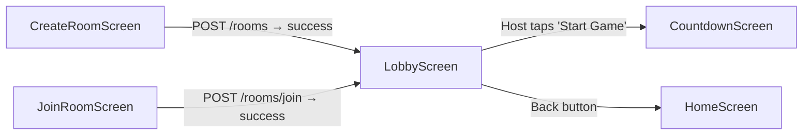

# Lobby Screen — Full Plan

## 1. What Is This Screen?

The Lobby is the **waiting room** after creating or joining a room. It's where all players gather before the game starts.

### What Users Do Here

| User Role | Actions |
|---|---|
| **Host** | See the room code, share it, see who joined, review settings, **press "Start Game"** |
| **Player** | See the room code, see other players, wait for host to start |
| **Both** | View room settings, see live feed, leave the room |

### Screen Sections (top → bottom)

```
┌─────────────────────────────┐
│  SynaxisAppBar + CONNECTED  │  ← status badge in app bar
├─────────────────────────────┤
│  DEPLOYMENT PROTOCOL        │
│  The Lobby                  │  ← header
├─────────────────────────────┤
│  ROOM CODE: XJ-992-ALPHA 📋│  ← copy-to-clipboard pill
├─────────────────────────────┤
│  [  START GAME  ]           │  ← host only (GlowButton)
├─────────────────────────────┤
│  Synchronized Agents  4/8   │
│  ┌─ Felix_Nova [HOST] ───┐  │
│  ├─ Luna_Void ───────────┤  │  ← player list (PlayerTile)
│  ├─ Kenji_01 ────────────┤  │
│  ├─ Cyber_Sarah ─────────┤  │
│  └─ [+ Invite Friend] ───┘  │
├─────────────────────────────┤
│  Room Settings              │
│  Difficulty: B2 Upper       │
│  Rounds: 12                 │  ← read-only settings card
│  Duration: 45s              │
│  Max Players: 8             │
│  "Only host can modify"     │
├─────────────────────────────┤
│  LIVE FEED                  │
│  Felix: Welcome everyone!   │  ← chat messages
│  Luna: Ready for grammar!   │
│  ~Sarah has joined~         │
└─────────────────────────────┘
```

---

## 2. How It Connects to Other Screens



| From | Trigger | To |
|---|---|---|
| `CreateRoomScreen` | API success → navigate `/lobby` | **Lobby** |
| `JoinRoomScreen` | API success → navigate `/lobby` | **Lobby** |
| **Lobby** | Host presses "Start Game" | `CountdownScreen` |
| **Lobby** | Back button | `HomeScreen` |

> [!IMPORTANT]
> For now, we build **UI only with mock data**. The WebSocket/API integration comes later. Navigation will use hardcoded demo data.

---

## 3. Files — What We Edit, Add, and What Goes Inside

### Overview

| Action | File | Purpose |
|---|---|---|
| **MODIFY** | `lobby_screen.dart` | Main screen — composes all sections |
| **MODIFY** | `player_tile.dart` | Single player row (avatar, name, badges, status) |
| **MODIFY** | `room_settings_card.dart` | Read-only settings display panel |
| **NEW** | `room_code_card.dart` | Room code pill with copy button |
| **NEW** | `live_feed_card.dart` | Chat/event feed panel |
| **MODIFY** | `app_router.dart` | Remove `AppPageShell` wrapper (lobby handles its own scaffold) |

---

### 3.1 `lobby_screen.dart` — Main Screen

**Location:** `features/room/presentation/screens/lobby_screen.dart`

**What it does:** Composes all lobby sections into one scrollable page. Uses mock data.

**Structure:**
```
Scaffold
  appBar: SynaxisAppBar(onBack, trailing: CONNECTED badge)
  body: NebulaBackground
    Column > Expanded > SingleChildScrollView
      _buildHeader()        → "DEPLOYMENT PROTOCOL" + "The Lobby"
      RoomCodeCard()        → room code + copy button
      GlowButton()          → "START GAME" (host only)
      _buildPlayerList()    → title row + PlayerTile list + Invite slot
      RoomSettingsCard()    → settings grid + host notice
      LiveFeedCard()        → feed messages
```

**Shared widgets used:** `NebulaBackground`, `SynaxisAppBar`, `GlowButton`, `StatusBadge`, `GlassmorphicPanel`

---

### 3.2 `player_tile.dart` — Player Row Widget

**Location:** `features/room/presentation/widgets/player_tile.dart`

**What it shows:**
```
┌─────────────────────────────────────────┐
│ [Avatar]  Felix_Nova [HOST]    [•••]    │
│           ● Ready to lead              │
└─────────────────────────────────────────┘
```

**Props:**
- `avatarIndex` (int) → maps to `av1.png` – `av10.png`
- `name` (String)
- `isHost` (bool) → shows HOST badge + cyan left border + star icon
- `status` (String) → "Ready to lead", "Synchronizing...", etc.
- `isOnline` (bool) → green dot on avatar
- `pingWarning` (String?) → "Slow Ping (240ms)" in amber

---

### 3.3 `room_code_card.dart` — Room Code Pill [NEW]

**Location:** `features/room/presentation/widgets/room_code_card.dart`

**What it shows:**
```
┌────────────────────────────────────┐
│  ROOM CODE                         │
│  XJ-992-ALPHA              [ 📋 ] │
└────────────────────────────────────┘
```

**Props:**
- `roomCode` (String)
- Copies to clipboard on button tap

---

### 3.4 `room_settings_card.dart` — Settings Grid

**Location:** `features/room/presentation/widgets/room_settings_card.dart`

**What it shows:**
```
┌──────────────────────────────────────┐
│  ⚙ Room Settings                    │
│  Difficulty (CEFR)     [B2 Upper]   │
│  Total Rounds          12 Rounds    │
│  Round Duration        45 Seconds   │
│  Max Players           8 Slots      │
│  ─────────────────────────────────  │
│  🛡 Only host can modify...         │
└──────────────────────────────────────┘
```

**Props:**
- `cefrLevel`, `totalRounds`, `roundDuration`, `maxPlayers`

---

### 3.5 `live_feed_card.dart` — Chat/Event Feed [NEW]

**Location:** `features/room/presentation/widgets/live_feed_card.dart`

**What it shows:**
```
┌──────────────────────────────────────┐
│  LIVE FEED                    💬     │
│  Felix_Nova: Welcome everyone!       │
│  Luna_Void: Ready for grammar!       │
│  ~Cyber_Sarah has joined the room.~  │
└──────────────────────────────────────┘
```

**Props:**
- `messages` (List of feed entries — player messages + system events)
- For MVP: hardcoded mock messages (no real WebSocket yet)

---

### 3.6 `app_router.dart` — Route Update

**Change:** Remove `AppPageShell` wrapper for lobby (same as we did for Home/Create/Join):

```diff
- builder: (context, _) => const AppPageShell(title: 'Lobby', child: LobbyScreen()),
+ builder: (context, _) => const LobbyScreen(),
```

---

## 4. Data Flow

For this **UI-only phase**, all data is mock/hardcoded inside `lobby_screen.dart`:

```dart
// Mock data — will be replaced by Riverpod providers later
final _mockRoomCode = 'XJ-992-ALPHA';
final _mockIsHost = true;
final _mockPlayers = [
  (name: 'Felix_Nova', isHost: true, avatar: 1, status: 'Ready to lead', isOnline: true, ping: null),
  (name: 'Luna_Void', isHost: false, avatar: 2, status: 'Synchronizing...', isOnline: true, ping: null),
  (name: 'Kenji_01', isHost: false, avatar: 3, status: 'Waiting for start', isOnline: true, ping: null),
  (name: 'Cyber_Sarah', isHost: false, avatar: 4, status: null, isOnline: true, ping: 'Slow Ping (240ms)'),
];
final _mockSettings = (cefr: 'B2 Upper', rounds: 12, duration: 45, maxPlayers: 8);
```

### Future Real Flow (not in this PR)
```
CreateRoom API → RoomSessionModel → navigate /lobby
                                     ↓
                              LobbyController (Riverpod)
                                     ↓
                              WebSocket events → update LobbyState
                                     ↓
                              LobbyScreen rebuilds via watch()
```

---

## 5. Summary — File Count

| Type | Count | Files |
|---|---|---|
| **Modify** | 4 | `lobby_screen.dart`, `player_tile.dart`, `room_settings_card.dart`, `app_router.dart` |
| **New** | 2 | `room_code_card.dart`, `live_feed_card.dart` |
| **Total** | 6 | |

All new widgets go in `features/room/presentation/widgets/` — they're **room-specific**, not shared.

## Open Questions

> [!IMPORTANT]
> 1. **"Invite Friend" button** — should it copy room code to clipboard (same as the code pill), or do something else?

> [!IMPORTANT]
> 2. **Live Feed** — should it be a separate card/panel, or should I skip it for now since it needs real WebSocket data?
