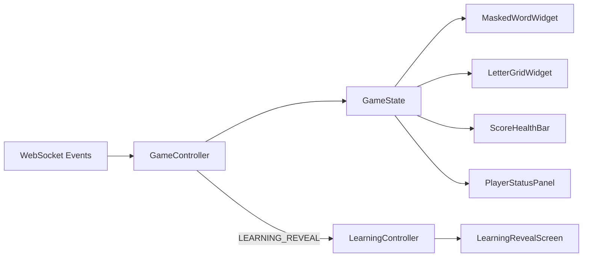

# Synaxis Flutter UI/UX Implementation Plan

> **Goal:** Transform the 9 provided UI screen designs (Cyanide Pulse / "soft-futuristic" aesthetic) into production-quality Flutter code, built on top of the existing scaffold in `frontend/`.

---

## Current State Assessment

The existing codebase already has:
- ✅ Feature-based folder structure (`lib/{app,core,features,shared}`) matching DDS §5
- ✅ `go_router` with all 9 routes defined (most screens are placeholders)
- ✅ Riverpod wired in `main.dart`
- ✅ Theme files: `app_colors.dart`, `app_spacing.dart`, `app_text_styles.dart`, `app_theme.dart`
- ✅ `ApiClient` (Dio), `WebSocketClient` (STOMP), `WsDestinations` scaffolded
- ✅ Dependencies: `flutter_riverpod`, `dio`, `stomp_dart_client`, `go_router`, `equatable`, `json_annotation`

**Critical gap:** The current theme uses a **light Material blue** palette (`#1E88E5` primary, `#F5F5F5` background, white surfaces). The designs demand a **dark, bioluminescent, soft-futuristic** aesthetic with `#0b0e14` background and `#58e7fb` (cyan) primary.

---

## User Review Required

> [!IMPORTANT]
> **Full Theme Overhaul Required.** The current `AppColors` and `AppTheme.light()` use a blue-on-white Material palette that has **no visual relationship** to the Cyanide Pulse designs. This plan replaces the entire color system with the dark futuristic tokens from the design mockups (DESIGN.md + HTML references). This is a **breaking change** for any existing UI — every screen will shift to dark mode.

> [!IMPORTANT]
> **Font Dependencies.** The designs use **Space Grotesk** (headlines) and **Plus Jakarta Sans** (body). These must be bundled as assets OR loaded via `google_fonts` package. This plan recommends bundling locally for performance and offline reliability.

> [!WARNING]
> **Bottom Navigation Bar.** The designs show a persistent bottom nav with 4 tabs (Home, Ranks, System, Leave). The existing DDS and router do **not** mention this tabbed navigation — it appears to be a design-only element. This plan treats it as a **shell decoration** that does not interfere with `go_router` screen flow, but we need your decision: **should the bottom nav persist across all screens, or only on certain screens?**

> [!IMPORTANT]
> **Arabic RTL Support.** The Learning Reveal screen shows Arabic text (المعنى العربي). The current project has no RTL or localization setup. This plan adds `Directionality` wrappers where needed, not full `flutter_localizations`.

---

## 1. UI Analysis — Screen-by-Screen Breakdown

### Design System: "Cyanide Pulse"

All screens share a cohesive visual language:

| Design Element | Specification |
|---|---|
| **Background** | Deep space `#0b0e14` with radial nebula gradient and 40px grid overlay |
| **Primary accent** | Bioluminescent cyan `#58e7fb` with glow effects |
| **Surface containers** | Layered from `#10131a` → `#161a21` → `#1c2028` → `#22262f` with backdrop blur |
| **Typography** | Space Grotesk (headlines, bold, geometric) + Plus Jakarta Sans (body, humanist) |
| **Borders** | No solid 1px borders; use opacity-based outlines `rgba(88,231,251,0.1-0.3)` |
| **Buttons** | Pill-shaped (`rounded-full`); primary uses cyan gradient with drop shadow |
| **Elevation** | Light-emission glow rather than Material shadows |
| **Icons** | Material Symbols Outlined, filled when active |

### 1.1 Home Screen
- **Layout:** Centered hero with top app bar + bottom nav
- **Components:** `SynaxisAppBar`, `BottomNavShell`, `GlowButton` (primary), `OutlineButton` (secondary)
- **Widget tree:** `Scaffold` → `Stack` (grid overlay + content) → `Column` (badge, title, subtitle, buttons)
- **Unique:** "THE ETHEREAL HEARTH" chip/badge, SYNAXIS hero text with `text-shadow` glow

### 1.2 Create Room Screen
- **Layout:** Scrollable form within a glassmorphic card panel
- **Components:** `SynaxisTextField`, `SynaxisDropdown`, `GlowButton`
- **Widget tree:** `SingleChildScrollView` → glassmorphic `Container` → `Column` (fields + CTA)
- **Fields:** Player Name, CEFR Level dropdown, Max Players, Total Rounds, Round Duration
- **Unique:** Dark input fields with subtle borders, status text "INITIALIZING VIRTUAL HEARTH"

### 1.3 Join Room Screen
- **Layout:** Simpler form — name + room code + CTA
- **Components:** Reuses `SynaxisTextField`, `GlowButton`
- **Widget tree:** Similar glassmorphic card pattern
- **Unique:** Room code in large spaced typography, "ENCRYPTED PORTAL" security badge

### 1.4 Lobby Screen (Centralized)
- **Layout:** Most complex static screen — scrollable vertical sections
- **Components:** `RoomCodeCard`, `PlayerTile`, `RoomSettingsCard`, `LiveFeedWidget`, `GlowButton`  
- **Sections:** Room code with copy button → Start Game CTA → Player list with status badges → Invite Friend → Room Settings panel → Live Feed
- **Unique:** "CONNECTED" status dot, player avatars with online indicator, HOST badge, "Slow Ping" warning, settings grid with labeled rows

### 1.5 Countdown Screen
- **Layout:** Full-screen immersive, minimal UI
- **Components:** `CountdownNumber` (large animated), `RoundBadge`, `StatusBar`
- **Widget tree:** Centered countdown number inside a concentric ring/circle animation
- **Unique:** Massive cyan number with glow, subtle ring animation, status bar at bottom (SYSTEM READY, Current Ping, Session ID)

### 1.6 Game Screen
- **Layout:** Dense, feature-rich — the core gameplay
- **Components:** `GameAppBar`, `ScoreHealthRow`, `MaskedWordDisplay`, `LetterGrid`, `LiveLobbyStrip`
- **Letter states:** 4 visual states — untouched (dark/outline), correct (cyan glow), wrong (red/pink), disabled
- **Widget tree:** `Column` → app bar → metrics → masked word area → letter grid → live lobby → bottom nav
- **Unique:** Letter buttons as rounded squares with 3:4 aspect ratio, integrity health bar, per-player status cards in bottom strip

### 1.7 Learning Reveal Screen
- **Layout:** Centered educational card stack
- **Components:** `DiscoveryIcon`, `WordCard` (Arabic RTL), `DefinitionCard` (English), `InsightBadge`
- **Widget tree:** `Column` → icon header → word + Arabic card → English definition card → inspirational quote → CTA
- **Unique:** Bilingual RTL/LTR layout, sparkle/star icon, "+25 Insight Points Earned" footer

### 1.8 Round Leaderboard
- **Layout:** Ranked list with header metadata
- **Components:** `LeaderboardHeader`, `LeaderboardEntry`, `GlowButton`, `WaitingIndicator`
- **Widget tree:** `Column` → header → column labels → list → CTA/waiting
- **Unique:** Current player row highlighted with cyan border, rank numbers with varying opacity, "PRIME SENTINEL" rank title, "Waiting for host..." animated dots

### 1.9 Final Leaderboard
- **Layout:** Celebratory podium + ranked list
- **Components:** `PodiumWidget` (1st/2nd/3rd), `RankCard` (your rank), `LeaderboardEntry`, `GlowButton`
- **Widget tree:** `Column` → header → podium (3 avatars with glow rings) → your rank card → remaining list → Leave Room CTA
- **Unique:** Podium layout with 1st centered/raised, avatar glow rings (cyan for 1st, blue for 2nd, pink for 3rd), MATCH MVP badge, level/class subtitle per player

---

## 2. Reusable Component Inventory

Based on cross-screen analysis, these widgets appear **3+ times** and warrant extraction:

### Tier 1 — Global Shell Components
| Widget | Usage | File |
|---|---|---|
| `SynaxisAppBar` | All 9 screens — pill-shaped top bar with back arrow + title + timer icon | `shared/widgets/synaxis_app_bar.dart` |
| `BottomNavShell` | All screens — 4-tab bottom nav (Home, Ranks, System, Leave) | `shared/widgets/bottom_nav_shell.dart` |
| `NebulaBackground` | All screens — radial gradient + 40px grid overlay | `shared/widgets/nebula_background.dart` |

### Tier 2 — Interactive Components
| Widget | Usage | File |
|---|---|---|
| `GlowButton` | Primary CTA across all screens — cyan gradient, pill, glow shadow | `shared/widgets/glow_button.dart` |
| `OutlineButton` | Secondary CTA (Home, Lobby) — outlined, translucent fill | `shared/widgets/outline_button.dart` |
| `SynaxisTextField` | Create Room (1), Join Room (2) — dark field with icon suffix | `shared/widgets/synaxis_text_field.dart` |
| `SynaxisDropdown` | Create Room (4 dropdowns) — dark styled dropdown | `shared/widgets/synaxis_dropdown.dart` |
| `GlassmorphicPanel` | Create Room, Join Room, Lobby settings — frosted glass container | `shared/widgets/glassmorphic_panel.dart` |

### Tier 3 — Feature Components  
| Widget | Usage | File |
|---|---|---|
| `PlayerTile` | Lobby (list), Game (strip) — avatar + name + status | `features/room/presentation/widgets/player_tile.dart` |
| `StatusBadge` | HOST badge, CONNECTED dot, SOLVED indicator | `shared/widgets/status_badge.dart` |
| `LeaderboardRow` | Round + Final leaderboards — rank + name + score + health | `features/leaderboard/presentation/widgets/leaderboard_row.dart` |

---

## 3. Architectural Design

### Pattern: **Feature-First Clean Architecture + Riverpod**

The existing DDS prescribes and the codebase already scaffolds this:

```
features/<feature>/
  data/           → DTOs, API services, repositories
  application/    → Controllers (Riverpod Notifiers), providers, state
  presentation/   → Screens, widgets (rendering only)
```

This remains the correct choice. The architecture is **already decided and scaffolded** — no change needed.

### Key Architecture Principles (from DDS, reinforced by UI analysis):

1. **Server Authority** — UI renders backend state only; no local score/health calculation
2. **Single Session** — one `RoomSessionModel` at a time, in-memory only
3. **Event-Driven Navigation** — screen transitions triggered by WS events, not user taps (except explicit CTAs)
4. **Buffered Leaderboard** — `ROUND/FINAL_LEADERBOARD` events buffered; navigation deferred until user taps "Go to Leaderboard"

---

## 4. State Management Strategy

### Approach: **Riverpod with Feature-Scoped Notifiers** (already decided)

The UI complexity from the designs validates Riverpod's suitability:

| State Scope | Provider Type | Justification |
|---|---|---|
| Room session (global) | `StateNotifier<RoomSessionModel?>` | Cross-feature identity + session lifecycle |
| Lobby players list | `StateNotifier<LobbyState>` | Real-time list mutations from WS events |
| Countdown ticks | `StateNotifier<CountdownState>` | Simple decrementing value |
| Game round state | `StateNotifier<GameState>` | Complex: masked word, letters, score, health, stun, solved, sudden death |
| Learning reveal data | `StateNotifier<LearningState>` | Set once from `GameController`, read-only on screen |
| Leaderboard entries | `StateNotifier<LeaderboardState>` | Buffered from events, toggle round vs final |
| **Theme mode** (NEW) | `StateProvider<ThemeMode>` | To support potential light/dark toggle (designs are dark-only for now) |
| **Bottom nav index** (NEW) | `StateProvider<int>` | Active tab for bottom navigation shell |

### State Flow for Most Complex Screen (Game):



---

## 5. Proposed Changes — Theme Overhaul

The largest structural change needed — replacing the light Material theme with the Cyanide Pulse dark theme.

### 5.1 Color Token Mapping (designs → Flutter)

#### [MODIFY] [app_colors.dart](file:///c:/Apps/synaxis-game-platform/frontend/lib/app/theme/app_colors.dart)

Replace entirely with Cyanide Pulse palette:

```dart
// Core surfaces (Deep Space foundation)
background:             #0b0e14  → Color(0xFF0B0E14)
surfaceDim:             #0b0e14  → same
surfaceContainerLowest: #000000  → Color(0xFF000000)
surfaceContainerLow:    #10131a  → Color(0xFF10131A)
surfaceContainer:       #161a21  → Color(0xFF161A21)
surfaceContainerHigh:   #1c2028  → Color(0xFF1C2028)
surfaceContainerHighest:#22262f  → Color(0xFF22262F)
surfaceBright:          #282c36  → Color(0xFF282C36)

// Primary system (Bioluminescent Cyan)
primary:                #58e7fb  → Color(0xFF58E7FB)
primaryDim:             #45d8ed  → Color(0xFF45D8ED)
primaryContainer:       #1cc2d6  → Color(0xFF1CC2D6)
onPrimary:              #00515b  → Color(0xFF00515B)
onPrimaryContainer:     #00363d  → Color(0xFF00363D)

// Secondary system
secondary:              #96a5ff  → Color(0xFF96A5FF)
secondaryContainer:     #2f3f92  → Color(0xFF2F3F92)

// Tertiary (lighter cyan)
tertiary:               #ccf9ff  → Color(0xFFCCF9FF)
tertiaryContainer:      #93f1fd  → Color(0xFF93F1FD)

// Text / surface content
onBackground:           #ecedf6  → Color(0xFFECEDF6)
onSurface:              #ecedf6  → same
onSurfaceVariant:       #a9abb3  → Color(0xFFA9ABB3)

// Status
error:                  #ff716c  → Color(0xFFFF716C)
errorContainer:         #9f0519  → Color(0xFF9F0519)
success:                #2E7D32  → keep for correct letters
warning:                #F9A825  → keep for sudden death

// Utilities
outline:                #73757d  → Color(0xFF73757D)
outlineVariant:         #45484f  → Color(0xFF45484F)
```

#### [MODIFY] [app_theme.dart](file:///c:/Apps/synaxis-game-platform/frontend/lib/app/theme/app_theme.dart)

- Rename `light()` → `dark()` (or add `dark()` alongside)
- Use `ColorScheme.dark(...)` with Cyanide Pulse tokens
- Update `scaffoldBackgroundColor` to `#0B0E14`
- Update `appBarTheme` to transparent/blur style
- Update `cardTheme` to glassmorphic dark surface
- Update `inputDecorationTheme` to dark fields
- Add `bottomNavigationBarTheme` for bottom nav

#### [MODIFY] [app_text_styles.dart](file:///c:/Apps/synaxis-game-platform/frontend/lib/app/theme/app_text_styles.dart)

- Add font family declarations: `Space Grotesk` for display/headline, `Plus Jakarta Sans` for body
- Add new scale entries from DESIGN.md: Hero Stats (4.5rem), Standard Labels (11px with 0.2em tracking), Micro-Data (8-10px)

#### [MODIFY] [app_spacing.dart](file:///c:/Apps/synaxis-game-platform/frontend/lib/app/theme/app_spacing.dart)

- Add `borderRadiusFull: 9999` for pill shapes
- Add `borderRadiusXl: 24` for large panels
- Add `glowSpread`, `glowBlur` constants for consistent glow effects

---

## 6. Proposed Changes — Screen Implementation

### Phase 1: Design System Foundation

#### [NEW] `shared/widgets/nebula_background.dart`
A `Stack` with radial gradient + grid overlay pattern that wraps every screen.

#### [NEW] `shared/widgets/synaxis_app_bar.dart`
Pill-shaped, floating app bar with backdrop blur. Replaces Material `AppBar`.

#### [NEW] `shared/widgets/bottom_nav_shell.dart`
4-tab bottom navigation with cyan active glow. Wraps `go_router` pages.

#### [NEW] `shared/widgets/glow_button.dart`
Primary CTA: cyan gradient fill, pill shape, glow shadow, loading/disabled states.

#### [NEW] `shared/widgets/outline_button.dart`
Secondary CTA: outlined, translucent, cyan border, hover/pressed effects.

#### [NEW] `shared/widgets/glassmorphic_panel.dart`
Frosted glass container: semi-transparent fill, backdrop blur, subtle border.

#### [NEW] `shared/widgets/synaxis_text_field.dart`
Dark-themed text input with cyan accent on focus, icon suffix support.

#### [NEW] `shared/widgets/synaxis_dropdown.dart`
Dark-themed dropdown matching design aesthetic.

#### [NEW] `shared/widgets/status_badge.dart`
Small label chip (HOST, CONNECTED, SOLVED, MATCH MVP) with color variants.

---

### Phase 2: Entry Screens (Home → Create → Join)

#### [MODIFY] `features/home/presentation/screens/home_screen.dart`
Full implementation:
- NebulaBackground wrapper
- SynaxisAppBar (back arrow + SYNAXIS + timer)
- "THE ETHEREAL HEARTH" chip badge
- "SYNAXIS" hero text (Space Grotesk, ~6xl, with glow)
- Tagline paragraph
- Create Room (GlowButton) → `/create-room`
- Join Room (OutlineButton) → `/join-room`
- BottomNavShell

#### [NEW] `features/room/presentation/screens/create_room_screen.dart`
Replace placeholder:
- SynaxisAppBar
- "Set the Hearth" title + subtitle
- GlassmorphicPanel containing form fields
- Player Name (SynaxisTextField)
- CEFR Level (SynaxisDropdown)
- Max Players (SynaxisTextField with icon)
- Total Rounds (SynaxisTextField with icon)
- Round Duration (SynaxisTextField with icon)
- Create Room (GlowButton) with rocket icon
- "INITIALIZING VIRTUAL HEARTH" footer text

#### [NEW] `features/room/presentation/screens/join_room_screen.dart`
Replace placeholder:
- SynaxisAppBar
- "Join the Hearth" title + subtitle
- GlassmorphicPanel with name + room code fields
- "ENCRYPTED PORTAL" security badge
- Join Room (GlowButton)

---

### Phase 3: Lobby

#### [MODIFY] `features/room/presentation/screens/lobby_screen.dart`
Full implementation:
- SynaxisAppBar with "CONNECTED" status
- "The Lobby" title with "DEPLOYMENT PROTOCOL" label
- Room code card with copy icon
- START GAME (GlowButton) — host only
- Synchronized Agents list (PlayerTiles with avatars, badges, status)
- INVITE FRIEND button
- Room Settings panel (CEFR, Rounds, Duration, Max Players)
- Host-only modification notice
- LIVE FEED section with chat-like entries
- BottomNavShell

#### [MODIFY] `features/room/presentation/widgets/player_tile.dart`
- Avatar circle with online indicator
- Player name + status text
- HOST badge chip
- Ping/connection quality indicator (e.g., "Slow Ping 240ms" in warning color)

#### [NEW] `features/room/presentation/widgets/room_settings_card.dart`
- Grid/table style settings display
- Difficulty, Rounds, Duration, Max Players rows

---

### Phase 4: Countdown + Game

#### [MODIFY] `features/countdown/presentation/screens/countdown_screen.dart`
- Full-screen immersive dark background
- "ROUND X OF Y" badge
- Massive animated countdown number (Space Grotesk, ~180sp)
- Concentric ring animation around number
- "INITIALIZING MATRIX" label
- Status bar (System Ready, Ping, Session ID)

#### [MODIFY] `features/game/presentation/screens/game_screen.dart`
- SynaxisAppBar with round, timer, stopwatch
- Score + Integrity (health) bar row
- Masked word display (large cyan letters, dots for hidden)
- LetterGrid (7-column grid of rounded letter buttons)
- LIVE LOBBY strip (horizontal scroll of mini player cards)
- BottomNavShell

#### [MODIFY] `features/game/presentation/widgets/letter_grid_widget.dart`
4 visual states per button:
- **Untouched**: Dark fill `surfaceContainerHigh`, cyan outline
- **Correct**: Cyan fill, bright text (letter lights up like the `S`, `N` in design)
- **Wrong**: Red/pink outline `#FF716C`, muted text
- **Disabled**: Very dim, no outline, reduced opacity

#### [MODIFY] `features/game/presentation/widgets/masked_word_widget.dart`
- Row of letter slots: revealed letters in cyan glow, hidden as dim dots
- Horizontal scrollable for long words

---

### Phase 5: Learning + Leaderboards

#### [MODIFY] `features/learning/presentation/screens/learning_reveal_screen.dart`
- Sparkle/star icon in cyan circle
- "NEW DISCOVERY" label
- Word title (large, serif-like)
- Arabic meaning card (RTL `TextDirection.rtl`, cyan text)
- English definition card (LTR)
- Inspirational quote in italics
- "Go to Leaderboard" (GlowButton) with chart icon
- "+25 Insight Points Earned" footer badge

#### [MODIFY] `features/leaderboard/presentation/screens/round_leaderboard_screen.dart`
- "SESSION COMPLETE" label
- "Round Leaderboard" title
- Column headers (Rank, Entity Name, Score, Core Stability)
- LeaderboardRow entries with rank highlighting
- Current player row with cyan border highlight + "CURRENT SECTOR" label
- "Next Round" (GlowButton) for host / "Waiting for host..." for others
- Low integrity percentage shown in red

#### [MODIFY] `features/leaderboard/presentation/screens/final_leaderboard_screen.dart`
- "Final Standings" title
- Podium section (3 avatar circles — 1st/2nd/3rd with glow rings):
  - 1st: Largest, centered, cyan glow ring, trophy icon, "MATCH MVP" badge
  - 2nd: Left, smaller, blue tint
  - 3rd: Right, smaller, pink tint
- YOUR RANK card (highlighted with cyan border)
- Remaining player list
- "Leave Room" (GlowButton) with exit icon
- BottomNavShell

---

### Phase 6: Polish + Performance

#### Animations to implement:
1. **Countdown pulse** — number scales with each tick
2. **Letter tap feedback** — brief glow flash on press
3. **Score delta** — "+50" / "-10" fly-up animation on score changes
4. **Health bar** — smooth width transition with inner glow
5. **Player join** — fade-in on lobby list
6. **Glow button press** — scale-down 0.95x + glow intensify
7. **Podium entry** — staggered scale-in on final leaderboard

---

## 7. Navigation & Theming Integration

### Navigation
The existing `go_router` setup is correct. The bottom nav shell needs to be integrated as a **visual wrapper** without interfering with route-driven navigation:

```dart
// Wrap screens in a ShellRoute for bottom nav
ShellRoute(
  builder: (context, state, child) => BottomNavShell(child: child),
  routes: [ /* all existing routes */ ],
)
```

Bottom nav tab actions (proposed):
- **Home** → `context.go('/')`
- **Ranks** → No-op or scroll to leaderboard section (design-decorative)
- **System** → No-op or settings sheet (design-decorative)
- **Leave** → Leave room flow if in session, else no-op

### Theming
- Single dark theme (Cyanide Pulse) as default
- `ThemeData.dark()` with full `ColorScheme` mapping
- All widgets consume theme via `Theme.of(context).colorScheme.*` — no hardcoded colors
- Active tab glow via `BottomNavigationBarTheme`

### Localization (Scoped)
- No full `flutter_localizations` for MVP
- Learning Reveal screen: `Directionality(textDirection: TextDirection.rtl, child: arabicText)`
- Font: Ensure body font supports Arabic glyphs (Plus Jakarta Sans does NOT — **use Noto Sans Arabic** for Arabic text blocks)

---

## 8. Performance Optimization

| Technique | Where | Why |
|---|---|---|
| `const` constructors | All stateless shared widgets | Avoid unnecessary rebuilds |
| `RepaintBoundary` | LetterGrid, ScoreHealthBar, MaskedWord | Isolate repaint regions during rapid WS updates |
| `AutomaticKeepAliveClientMixin` | Lobby player list, Game player strip | Prevent re-fetch on tab switch |
| `AnimatedBuilder` / `TweenAnimationBuilder` | Countdown number, health bar, score delta | Hardware-accelerated implicit animations |
| `BackdropFilter` usage | Limit to app bar + glassmorphic panels only | `BackdropFilter` is expensive — avoid on per-item widgets |
| `ListView.builder` | Lobby player list, leaderboard entries | Lazy rendering for scrollable lists |
| `Selector` / `select` on providers | GameScreen sub-widgets | Only rebuild when relevant state slice changes |
| Shader warm-up | Countdown ring, glow effects | pre-cache shaders to avoid jank on first frame |
| Image caching | Player avatars (future) | `CachedNetworkImage` or similar when avatar system exists |

---

## 9. Testing Strategy

### 9.1 Unit Tests

| Target | Coverage Goal | Tooling |
|---|---|---|
| State classes (`GameState`, `LobbyState`, etc.) | 100% field mutation | `flutter_test` |
| Controllers (`GameController`, `LeaderboardController`) | All event handler methods | Riverpod `ProviderContainer` |
| Repositories (`RoomRepository`) | Request/response mapping | Mocked `Dio` |
| Error mapping (`ErrorMapper`) | All known error codes | Pure dart tests |
| Theme tokens (`AppColors`) | All colors within contrast spec | Simple assertions |

### 9.2 Widget Tests

| Target | What to verify | Priority |
|---|---|---|
| `GlowButton` | Renders label, handles tap, shows loading/disabled states | High |
| `LetterGridWidget` | 26 buttons, correct/wrong/disabled color states, tap callbacks | High |
| `MaskedWordWidget` | Renders revealed chars vs dots, updates on state change | High |
| `PlayerTile` | Shows name, host badge, online/offline indicator | Medium |
| `LeaderboardRow` | Rank, score, highlight current player | Medium |
| `SynaxisAppBar` | Back button fires, title renders | Medium |
| `GlassmorphicPanel` | Renders child, visual properties | Low |

### 9.3 Integration Tests (Manual + Automated)

| Flow | Devices | Acceptance |
|---|---|---|
| Create room → Lobby | 1 device | Session saved, WS connected, room code shown |
| Join room → Lobby | 2 devices | Both see each other in player list |
| Lobby → Countdown → Game | 2 devices | Synchronized transition, round number correct |
| Guess letter → visual feedback | 1 device | Correct=cyan, wrong=red, disabled after guess |
| Stun → recovery | 1 device | Overlay appears, buttons disabled, overlay lifts |
| Round end → Learning → Leaderboard | 2 devices | Word+meaning shown, leaderboard loads after tap |
| Final leaderboard → Leave | 1 device | REST call, WS disconnect, return to Home |
| Reconnect (WS drop) | 1 device | Correct screen restored from snapshot |

### 9.4 Visual Regression (Future)

- `golden_toolkit` for pixel-perfect widget snapshots against design mockups
- Compare at 375px width (mobile) and 560px (max content)

---

## 10. Font & Asset Setup

### Fonts to bundle in `assets/fonts/`:
1. **Space Grotesk**: Regular(400), Medium(500), SemiBold(600), Bold(700)
2. **Plus Jakarta Sans**: Light(300), Regular(400), Medium(500), SemiBold(600), Bold(700)
3. **Noto Sans Arabic**: Regular(400), Bold(700) — for Learning Reveal Arabic text

### `pubspec.yaml` additions:
```yaml
flutter:
  fonts:
    - family: SpaceGrotesk
      fonts:
        - asset: assets/fonts/SpaceGrotesk-Regular.ttf
        - asset: assets/fonts/SpaceGrotesk-Medium.ttf
          weight: 500
        - asset: assets/fonts/SpaceGrotesk-SemiBold.ttf
          weight: 600
        - asset: assets/fonts/SpaceGrotesk-Bold.ttf
          weight: 700
    - family: PlusJakartaSans
      fonts:
        - asset: assets/fonts/PlusJakartaSans-Regular.ttf
        - asset: assets/fonts/PlusJakartaSans-Medium.ttf
          weight: 500
        - asset: assets/fonts/PlusJakartaSans-SemiBold.ttf
          weight: 600
        - asset: assets/fonts/PlusJakartaSans-Bold.ttf
          weight: 700
    - family: NotoSansArabic
      fonts:
        - asset: assets/fonts/NotoSansArabic-Regular.ttf
        - asset: assets/fonts/NotoSansArabic-Bold.ttf
          weight: 700
```

---

## Open Questions

> [!IMPORTANT]
> 1. **Bottom Nav Behavior:** Should the bottom nav persist on ALL screens (including Countdown and Game), or only on non-gameplay screens? The designs show it on most screens but it could interfere with immersive gameplay.

> [!IMPORTANT]
> 2. **Player Avatars:** The designs show cyberpunk-style character avatars for players. For MVP, should we use generated placeholders (initials in a colored circle), or is there an avatar asset system planned?

> [!IMPORTANT]  
> 3. **Font Bundling vs Google Fonts Package:** Bundling fonts in assets adds ~2-3MB to the app but works offline. The `google_fonts` package downloads on first use and caches. Which approach do you prefer?

> [!WARNING]
> 4. **Design Pixel-Perfection vs Functional MVP:** The Cyanide Pulse designs are extremely polished with backdrop blur, glow shadows, grid overlays, and gradient textures. Implementing ALL visual effects at production quality will take significantly longer than building functional screens with simpler visuals. Do you want to prioritize **pixel-perfect fidelity** in Phase 1, or **functional completeness** first with visual polish in a later pass?

---

## Verification Plan

### Automated Tests
```bash
cd frontend
flutter test                          # Unit + widget tests
flutter analyze                       # Static analysis
dart format --set-exit-if-changed .    # Code formatting
```

### Manual Verification
- Compare each screen side-by-side with its `screen.png` from `docs/stitch_synaxis_game_ui_ux/`
- Two-device multiplayer test per DDS §22
- RTL rendering check on Learning Reveal
- Performance profiling: no jank during countdown animation, letter grid re-renders, or leaderboard transitions

### Browser Testing (Web)
- Verify at 375px, 560px, and 1280px widths
- Check `BackdropFilter` compatibility (known issues on some browsers)
- Verify `wss://` WebSocket connectivity
